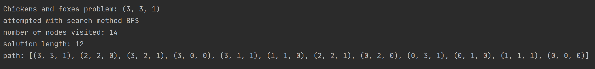
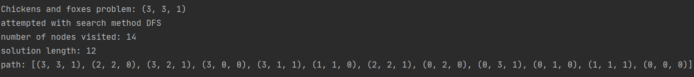
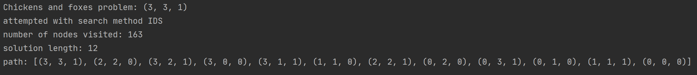
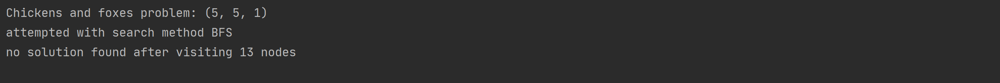
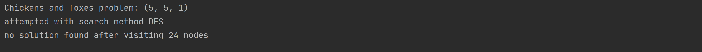
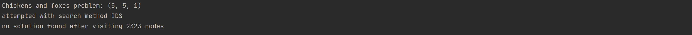
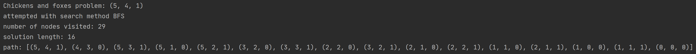
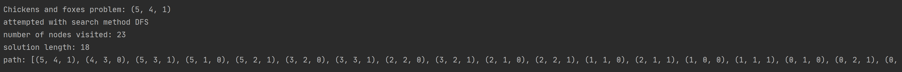
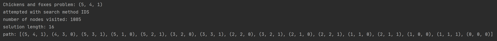

# PA1 - Chicken and foxes
_2020 Fall - CS 076/276 F00422M Mingi Jeong_

## Introduction
1. State definition
    * According to the guidance of PA-1, I chose to define a state indicating how many chickens and foxes are on 
    the starting side as well as the boat is located on the starting side or not.
    * For example, the starting state as (3,3,1) represent a state that the boat is located on the starting side with 
    total number of 3 chickens and foxes, respectively. If the boat takes one chicken and one fox to the other side, 
    the resultant state on the original side will be (2,2,0). 
    * Based on an intuitive reasoning by the instruction, we can easily get the state on the other side by subtraction. I implemented
    this by using 'operator' library for tuple subtraction. Hence, the state on the other side is (3,3,1) - (2,2,0) = (1,1,1).
    In other words, there is one chicken and one fox together with the boat.
    * Note that the state represented in a tuple indicate the state of 'chicken', 'fox', and 'boat' in order.
 
1. Upper bound on the number of the states
    * Based on the state definition above, we can derive the upper bound on the number of the states without considering legality.

    
    
    * Considering three slots as per the shown figure, it is just basic math calculation for the total upper bound.
    Given the number of chicke and foxes is three with one boat, the upper bound is (3+1) * (3+1) * (1+1) = 32. 
    * If we are given x chickens, y foxes with one boat, the upper bound is derived by (x+1) * (y+1) * (1+1) for generalization.
    
1. Action and state change

    
    
    * As an example drawing, the starting state (colored in sky blue) is (3,3,1). Based on all actions possible,
    the legal actions are shown in green whereas the illegal actions are shown in red.
    * To be specific, from the left side under the start state, (1) moving 1 fox only, (2) moving one chicken only (3) moving
    one chicken and one fox, (4) moving two foxes, (5) moving two chickens. As a result, (2,3,0) and (1,3,0) states  are not legal 
    now that it has more number of foxes than that of chickens on the starting side.
    * For the second depth, I indicated states in red, e.g., (3,3,1) if they are generated from an illegal parent, e.g., (2,3,0).
    * Note: I indicated the states on the other side outside of the ellipses for reference.
    * This successor obtaining is implemented as get_successor function in my code.

## Code design
   * There are two main scripts I edited: _FoxProblem.py_ and _uninformed_search.py_. Details are included in this report and in scripts as comments.
   * The other two files (_foxes.py_ and _SearchSolution.py_) are used samely as the given version by PA-1.
   * You can check my code by running _foxex.py_ regardless of an algorithm's success to find a goal state.

## Building the model
This is mainly explanation about _FoxProblem.py_.
1. Properties
    * For class FoxProblem's properties, I used same start_state and goal_state. Therefore, we keep track of states on the starting dock side until it 
    reach the goal_state (0,0,0). The other side's state can be automatically obtained by tuple subtraction as I used in the scripts.
    * I additional set up goal_found class variable to store boolean indicting whether the goal state is found or not. This is useful after dfs is done with finding the goal.
    In addition, when I implemented IDS, I used an expanded version of DFS; thus, I re-initiated .goal_found state as False in order to prevent IDS from failing to find the goal right after DFS.
    * There are variables storing total number of chickens and foxes. It is initiated by the start state, but it is useful to keep track of the numbers and get successors by comparing expected states.
    
2. Methods
    * goal_test: if a state is a goal_state, it returns True whereas it returns False, otherwise.
    * get_successors: With the use of successor_helper function, I implemented to return a list of successors from a given state.
    It checks all the possibilities similar way to the node drawing as shown above (e.g., one chicken move, one fox move, one chicken and one fox move, 
    two chickens moves, two foxes move depending on the currents states of each side on the dock as well as location of the boat. 
    Based on the expected successors, I wrapped legality_check function 
    to return all the legal states only as successors.
    * legality_check: Using an expected state, it confirms that the state is valid or not. Specifically, it does not make a state where a chicken 
    is eaten by foxes. 

## Uninformed search
From here, it is explanation about _uninformed_search.py_.
I implemented class SearchNode containing variables: state, parent_node, depth, branch_path. Here,
depth is to keep track of a certain node depth useful for DFS. branch_path is useful for 'path_checking' DFS. 
The details are included in the following sections in this report as well as in the script.

## Breadth-first search
* According to the instruction, I made a functionality to keep track of visited states. The data structure used for this graph search
is 'set' in python. By doing this, we have less time complexity to check a member in the set and add it to the set.
* For BFS' FIFO fringe implementation, I used 'deque' in python. While the queue has a member inside, it continues searching.
FIFO was implemented by .popleft and .append. 
* Back-chaining: This is not only for BFS, but also for other searches. I made this as an independent helper function. 
Starting from the goal_state, it goes up to the root_node by utilizing .parent property. In the end, it returns a path starting from the root to the goal (left to right in the list).
* If BFS finds the goal_state by using 'goal_test' function in FoxProblem class, it updates SearchSolution class's path, node_visited and FoxProblems' goal_found property.
Then, it returns 'solution' which is instantiated at the beginning of BFS.
* If the goal_state was not reached, it still returns 'solution' so that we can check information in _foxes.py_.
  
## Depth-first search
1. Discussion (Memoization):
    * To entirely keep track of all states visited, it is possible to use memoization as what we do for graph search.
    * However, if we do memoizing, the space complexity can be more than BFS. BFS' space complexity is _O(b^d)_ where _b_ is branching factor and _d_
    is depth level during BFS. DFS with memoizing
    can have space complexity _O(b^m)_ where _m_ stands for maximum depth during DFS search. As _m_ is usually larger than _d_,
    memoizing DFS does not save memory with respect to BFS.
 
1. Path-checking DFS
    * Instead of memoizing dfs, I used path-checking dfs as per the instruction. The main concept of path-checking DFS is not
    storing the entire states visited, but check a partial branch where the current state belongs. I implemented by using .branch_path in SearchNode class.
    The data structure I used is 'set' in python. By using 'set', it is more efficient than other data structures such as 'list'.
    * This follows the general definition of node containing information such as parent, branch_path, depth, etc.
    Another possible way is to make a global 'set', but I used inside SearchNode class, as node will disappear also when removed from the branch_path
    (successor_node.branch_path.remove(successor_node.state)).
    * Main idea behind is (1) if there is repetition, the node checks whether upcoming successor inside the node's branch path. If so, DFS does not expand the tree on that node any more
    since it will be making an infinite loop. (2) If DFS fails to find at a certain branch after reaching the last possible state, it removes the node from branch_path as described above.
    Therefore, path-checking DFS makes the problem 'complete' and 'memory efficient'.
    * There are three main parts in my code: 
        * main dfs_search: this function initiate DFS problem with a node and a solution if not given. It also contains checking at the depth level _0_.
        * dfs_search_helper_path_check: This contains (1) main recursive part based on successors from a given node and (2) base cases which do not return goal_state solution.
        * back_chaining after goal check: when the goal_state is found, it updates 'solution' of which class is SearchSolution.
    * Finally, it returns 'solution'. We can see the detailed information by executing _Fox.py_. If it found the goal, it prints out valid number visited, solution length, and solution path.
    * Note: As per the instruction by the professor on Slack, number of node visited here is counting when a node was explored.

3. Discussion (Path-checking DFS vs BFS)

    

    * Memory: In a normal case, path-checking DFS is supposed to save significant memory with respect to BFS.
    The reason is that BFS saved all the visited nodes in 'set' whereas path-checking DFS removed visited nodes which didn't lead the algorithm to the goal state. 
    As I mentioned, it is implemented inside SearchNode class's branch_path property. Theoretically, after unnecessary nodes disappear upon doing recursive parts, 
    it could reach _O(b*m)_ space complexity for path-checking DFS. 
    * Time: there are cases that path-checking dfs takes much more time than BFS. Even if the goal state is very close to the start state,
    in case that DFS deeply search branches far from the goal state, DFS needs many expansion. On the other hand, BFS can find the goal state
    as it expanded in a way of expanding the depth level by depth level. As shown in the figure, if DFS starts from the left side expansion first,
    it goes down to all the nodes located in that branch whereas BFS can find the goal by only two level expansions.
    
    
## Iterative deepening search
1. Implementation 
    * Depth limited search is already implemented by DFS given it has an input function argument as depth_limit.
    * For iterative deepening search (IDS), I used an expanded version by wrapping the original DFS I used. By simply using 'for' sentence,
    I was able to change the depth limit by incrementing 1. After sending it as an argument of DFS, I conducted IDS successfully.
    * The result is also returned as 'solution' of which class is SearchSolution. _Fox.py_ can print out its detailed information depending on whether the algorithm reach the goal or not.
    I made the code also print out failure as per increment of the depth_limit. 
    * Shortest path: I checked that the paths by IDS have the same length as BFS. For example, FoxProblem(3,3,1) has a solution length 12 and FoxProblem(5,4,1) has 16.
1. Discussion (On a graph)
    * This is an interesting discussion. If this is 'tree search' not keeping track of all the visited nodes, path-checking dfs is more efficient.
    When it comes to time, it is represented as _O(b^d)_ since it is expanding based on depth level by depth level. However, for space complexity, path-checking based
    IDS is represented as _O(b*d)_ by deleting unnecessary branches as DFS did.
    * On the other hand, in case of 'graph search' keeping track of all the visited node, the space complexity will be 
    samely represented as _O(b^d)_. Therefore, it is not better than BFS. So, I would rather use BFS.
    * One important thing is that IDS will visit much more nodes even if its general concept is DFS + BFS. To be specific,
    by expanding from the start state, IDS should keep hitting the same nodes multiple times as per depth_limit increments while BFS can only hit once. 

## Discussion - Lossy Chickens and Foxes
* Firstly, I will make a state represented by four numbers in a tuple (Chicken, Eaten Chicken, Fox, Boat). The boat part is samely expressed in binary: 1 means
the boat is docked at the goal side, 0 means the boat is on the other dock side. The first index as chicken will stands for how many chickens (alive) are in the same way as we did.
Eaten chicken stands for how many chickens are eaten in total (regardless of the starting side or the other side). The third index as fox will stand for how many foxes are as we did.
* Next, we should change a legality check. In this problem, we did not get a successor making a chicken eaten. However, given a certain number E as constant, we can make a chicken eaten.
Another important thing is that the number of eaten chicken is not necessarily same as E, which means it is no more than E, as per the instruction.
* Moreover, the upper bound on the number of possible states are considered in a more complicated way. Total number of Fox (F) and binary state for Boat (B) do not vary depending on E value. Therefore, we always have (F+1) * 2 as a multiplication factor where 2 is from (1+1) for the boat.
Based on this, let's say total number of chicken (T) at the beginning was 3 as an example. Let's put currently eaten number of chicken as N.
The current number of chicken (C) + N should be no more than T, as N is less than or equal to E by the instruction.
If E = 1, N can be 0 or 1. In such a case, possible states are  (T+1) * (F+1) * 2 + (T) * (F+1) * 2. The former part is when N = 0, whereas the latter part is when N = 1.
From this derivation, the upper bound will be (T+1) * (F+1) * 2 + (T) * (F+1) * 2 + (T-1) * (F+1) * 2 +...+ (T-E) * (F+1) * 2.

## Appendix
Here is screenshots for printing out result when running _fox.py_.
* BFS (3,3,1)

* DFS (3,3,1)

* IDS (3,3,1)

* BFS (5,5,1)

* DFS (5,5,1)

* IDS (5,5,1)

* BFS (5,4,1)

* DFS (5,4,1)

* IDS (5,4,1)
